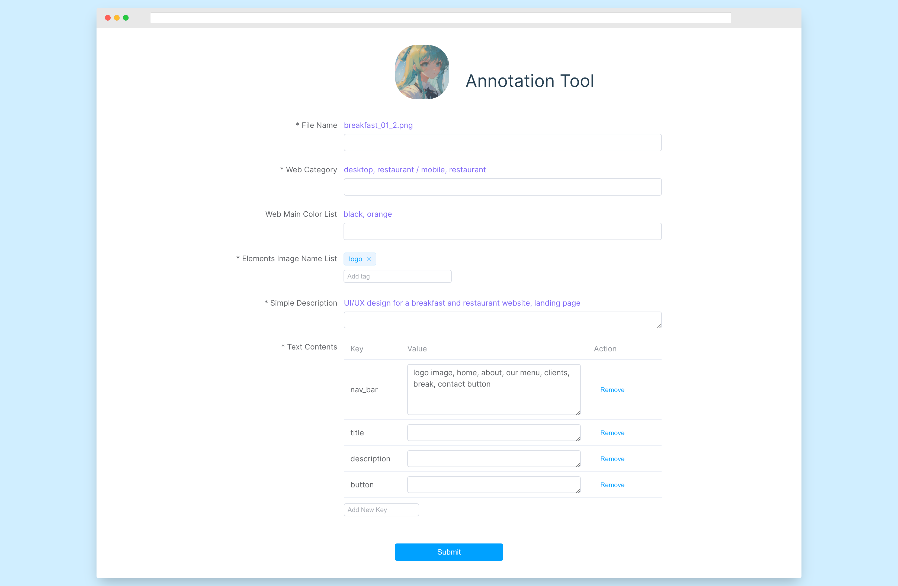

# Text2UI_WebLabeler

Welcome to the powerful image annotation tool! With just a few clicks, you can easily submit your annotations and save them as a JSON file on the server. 

Our user-friendly interface is designed to help you get the job done quickly and efficiently. With intuitive tools and clear labeling options, you can annotate your images with ease. So what are you waiting for? Start annotating your images today with our powerful and easy-to-use web tool!



## Project Setup

```sh
cd Text2UI_WebLaberler
npm install
```

## Install other packages needed

```sh 
npm install axios
npm install element-plus --save
```

## Compile and Hot-Reload for Development

```sh
npm run dev # for the app

cd server
python server.py # Run the server to receive the data
```
